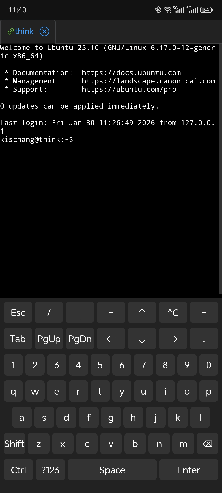
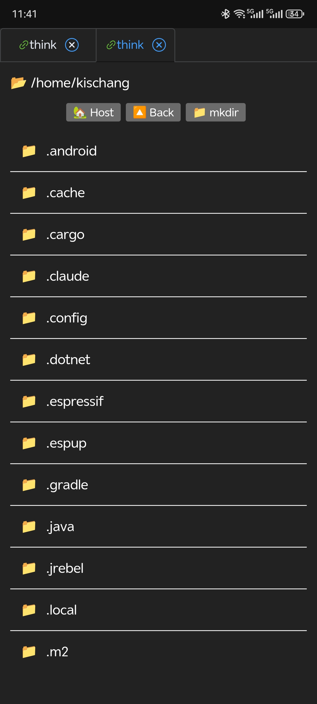
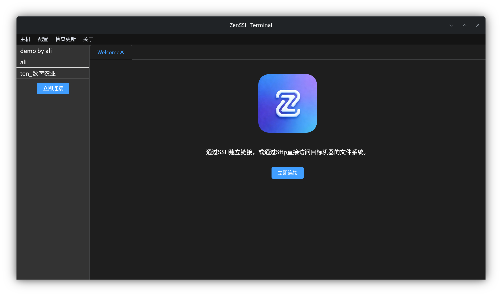
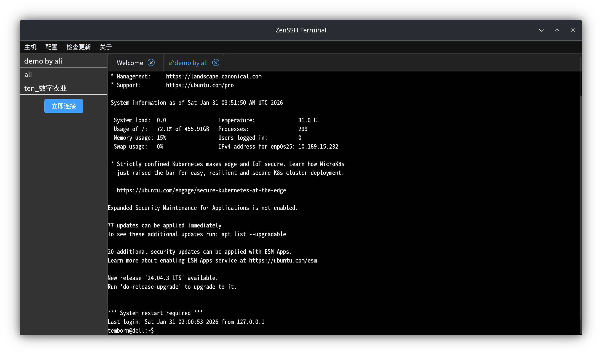
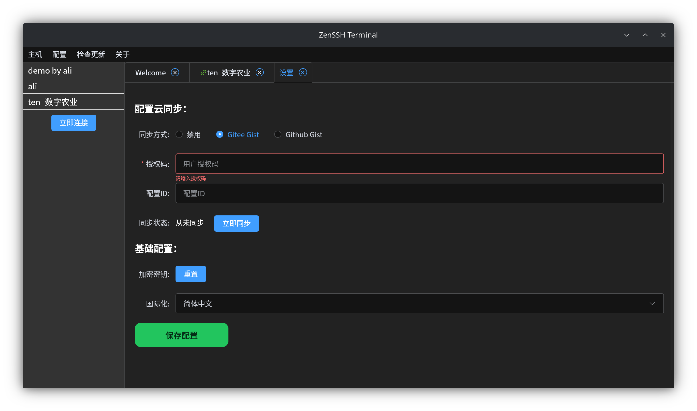

ZenSSH
=======================

  

<a href="README.md">中文</a> | 
<a href="README_en.md">English</a>

ZenSSH 是一款基于 Tauri 构建的全平台 SSH 客户端，支持 SSH 连接与 SFTP 文件传输，支持跳板机，专注于提供简洁、稳定、易用的核心功能体验。

项目目标是在保证轻量与性能的前提下，满足日常 SSH 使用场景，避免复杂冗余的功能设计，适合开发者和运维人员的日常使用。

注意！当前为早期开发版，仅验证核心功能可用，未完整测试。

## Features 

- [x] SSH\Sftp\跳板机
- [x] Gist Sync配置功能
- [x] 自动更新(仅PC端)
- [ ] 文本文件预览和编辑
- [ ] Shell专用键盘，键盘震动
- [ ] 自动完成

## Screenshot (Android)

<table>
<tr>
<td></td>
<td></td>
<td></td>
</tr>
</table>

## Screenshot (PC)

<table>

<tr>
<td></td>
<td></td>
<td></td>
</tr>
</table>

## IDE Setup

- [VS Code](https://code.visualstudio.com/) + [Volar](https://marketplace.visualstudio.com/items?itemName=Vue.volar) + [Tauri](https://marketplace.visualstudio.com/items?itemName=tauri-apps.tauri-vscode) + [rust-analyzer](https://marketplace.visualstudio.com/items?itemName=rust-lang.rust-analyzer)

## 说明

src-tauri 目前暂未开源，后续会考虑开源。

## 开源协议 / 许可证（License）

[MIT License with Commons Clause](LICENSE-COMMONS-CLAUSE.txt)  

本项目采用 **MIT License + Commons Clause**。

- 允许个人及非商业用途的使用、修改和分发
- **不允许任何商业用途**

如需将本项目用于商业目的（包括但不限于商业产品、付费服务或其他任何形式），  
请联系作者获取**商业授权**。

📧 联系方式：734615869@qq.com

